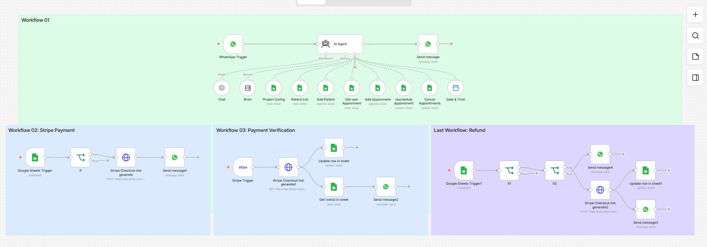

# 🏥 Medical Appointment Booking System
> Built with n8n, Stripe, WhatsApp & Google Sheets

## 🔧 Tech Stack
- **Automation**: n8n
- **Payment**: Stripe Checkout
- **Messaging**: WhatsApp / Telegram
- **Database**: Google Sheets
- **AI**: OpenAI GPT-4o

## 📋 Workflows

### Workflow 01 — AI Agent
Patient books an appointment by receiving a WhatsApp message

### Workflow 02 — Stripe Payment
If the appointment is confirmed, the payment link will be generated and sent

### Workflow 03 — Payment Verification
Stripe updates the sheet when payment is confirmed via webhook

### Workflow 04 — Refund
When a cancellation request is received, Stripe processes the refund

## 🏗️ Architecture

## ⚙️ Setup Guide
1. Install n8n
2. Import JSON from the `workflows/` folder
3. Configure credentials: 
- Stripe API Key 
- WhatsApp credentials 
- Google Sheets OAuth
4. Activate Workflows

  
